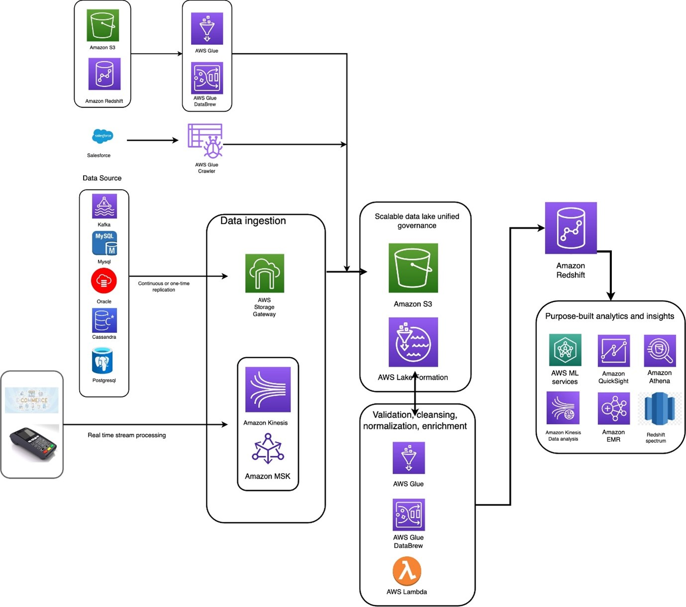

# AWS-Data-Analytics-Project

Led the design and implementation of a scalable, secure AWS Cloud-based data analytics architecture for enhancing financial data processing capabilities. 
Integrated AWS services (S3, Redshift, EMR, Glue, QuickSight, Athena, SageMaker, Comprehend) to automate ETL processes, support big data analytics, and enable advanced machine learning applications. 
Enforced data security and compliance (PCI DSS, GDPR, SOX) using AWS KMS for encryption and IAM for access management, ensuring robust data protection measures. 
Deployed AWS QuickSight and Athena for real-time analytics and ad-hoc querying, improving business intelligence and decision-making processes. 
Leveraged AWS SageMaker and Comprehend for machine learning and natural language processing, enhancing anomaly detection and sentiment analysis. 
Optimized costs and operational efficiency through strategic use of AWS's pay-as-you-go pricing, Cost Explorer, and Budgets, achieving significant savings and budgetary control. 
Established a comprehensive data governance strategy with AWS Glue, facilitating data cataloging, lineage tracking, and governance to maintain data integrity and accessibility. 
